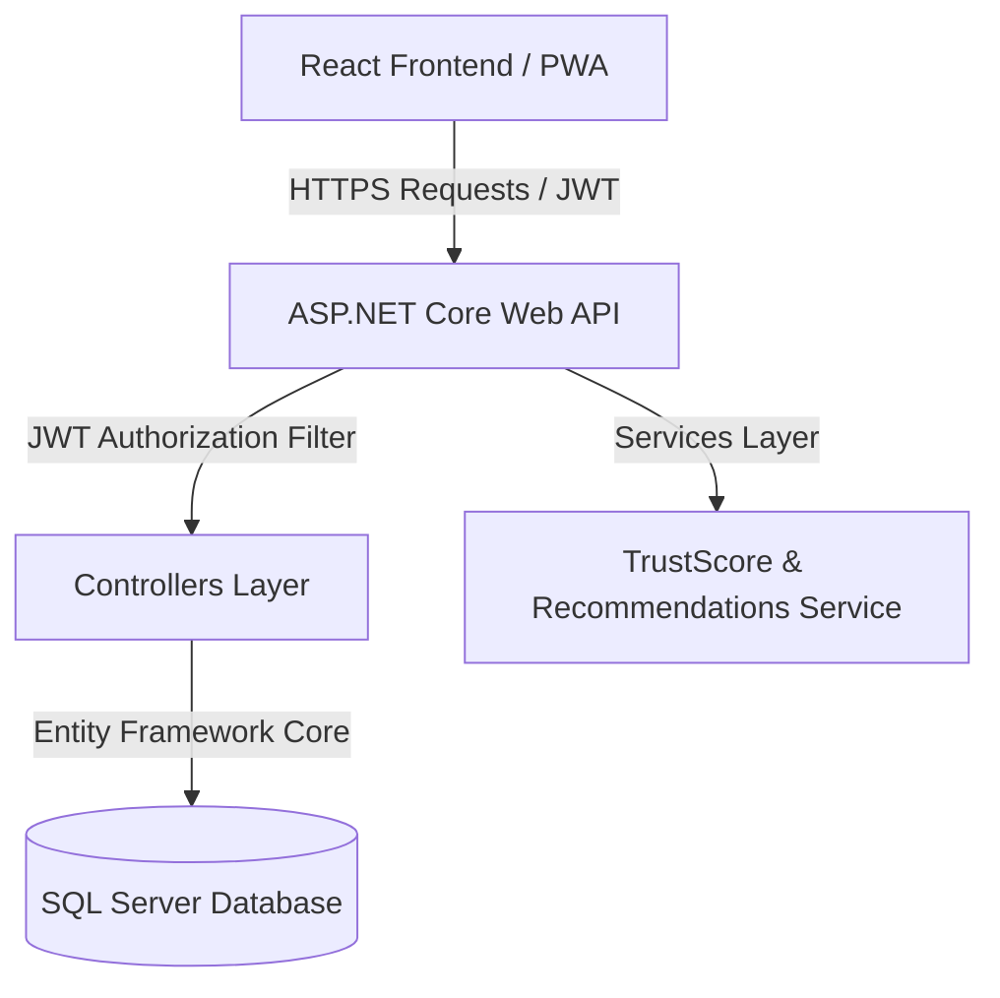

# ServiceConnect - Local Service Booking Platform

ServiceConnect is a modern, full-stack local service booking web application built using **ASP.NET Core Web API** and **React + Vite**. It enables customers to find, chat, live-track, and book local service providers (electricians, plumbers, cleaners, etc.), while allowing providers to manage listings, verification (KYC), availability, and track their dynamic **Trust Score**.

---

## 🌟 Key Features

1. **Dual Role Dashboards**: Custom interfaces for **Customers** (booking flow, service list, active status tracking) and **Providers** (KYC validation, availability calendars, service configuration, wallet/earnings).
2. **Dynamic Provider Trust Score**: An automated rating (0-100) calculated from average rating (40%), booking completion rates (30%), cancellation rates (15%), and industry experience (15%). Includes tier badges (Excellent, Trusted, Good, New).
3. **Audit Trail & Timeline**: Interactive visual timeline detailing step-by-step history logs of booking statuses (Pending -> Accepted -> In Progress -> Completed), noting change dates and optional operator remarks.
4. **Live Chat & Real-Time Tracking**: Integrated chat window and live geographical status tracking (with simulation coordinates) for ongoing tasks.
5. **Installable PWA**: Installable as a progressive web application on mobile or desktop, featuring an offline fallback page, manifest caching, and custom app icons.
6. **Dark/Light Mode**: Full visual adaptation to dark theme preferences via class-based Tailwind triggers.
7. **Role-based Authentication**: Secure login pathways built with JWT validation and path authorization (Customer, Provider, Admin).

---

## 💻 Tech Stack

- **Backend**: ASP.NET Core Web API, Entity Framework Core, JWT Authentication, Swagger API Docs.
- **Database**: Microsoft SQL Server.
- **Frontend**: React (Vite), Tailwind CSS, Lucide Icons, Axios.
- **PWA Capabilities**: Service Worker caching, Web App Manifest.

---

## 🏗 System Architecture



### Database Schema Structure
- **Users**: Core user table hosting profile info, email credentials (hashed), roles, and experience.
- **Services**: Provider service offerings (title, category, pricing, duration).
- **Bookings**: Transaction records linking customers, providers, date/time scheduling, and total pricing.
- **BookingStatusHistories**: Historical log tracking all status changes, timestamps, and custom comments.
- **Reviews**: Customer reviews, scores, and text feedback.
- **Complaints**: Customer complaint registrations moderated by administrator dashboards.

---

## 🚀 Local Setup Instructions

### 1. Database Configuration
1. Ensure Local SQL Server is running.
2. The database connection is configured in `backend/LocalServiceBooking.API/appsettings.json` under `ConnectionStrings:DefaultConnection`. It defaults to:
   ```json
   "Server=localhost;Database=LocalServiceBooking;Trusted_Connection=True;TrustServerCertificate=True;"
   ```
3. Run the database seed SQL scripts inside the `/database` directory to initialize mock data and schema structures:
   - [`create_history_table.sql`](database/create_history_table.sql)
   - [`seed_status_history.sql`](database/seed_status_history.sql)

### 2. Run the Backend API
1. Navigate to the backend directory:
   ```bash
   cd backend/LocalServiceBooking.API
   ```
2. Build and start the service:
   ```bash
   dotnet run
   ```
3. The server will launch and listen on `http://localhost:5000`. You can inspect the interactive Swagger API docs at `http://localhost:5000/swagger`.

### 3. Run the Frontend React App
1. Navigate to the frontend directory:
   ```bash
   cd frontend/local-service-booking
   ```
2. Install npm dependencies:
   ```bash
   npm install
   ```
3. Run the development web server:
   ```bash
   npm run dev
   ```
4. The frontend will start on `http://localhost:5173` (or `http://localhost:5174` if 5173 is occupied).

---

## 🔐 Presentation Credentials

For testing and demonstration, use the following sample accounts:

| Role | Email Address | Password |
|---|---|---|
| **Customer** | `customer@serviceconnect.com` | `Password123!` |
| **Provider (Electrician)** | `electrician@serviceconnect.com` | `Password123!` |
| **Provider (Cleaner)** | `cleaner@serviceconnect.com` | `Password123!` |
| **Administrator** | `admin@serviceconnect.com` | `Password123!` |

---

## 🛡 Security & Deployment Guidelines

1. **Independent Hosting**:
   - Build frontend assets using `npm run build` and deploy to statically hosted CDNs (Netlify, Vercel, Firebase Hosting).
   - Package the backend container using Docker or host on ASP.NET Cloud platforms (Azure App Service, AWS Elastic Beanstalk).
2. **Environment Variables**:
   - Overwrite CORS Allowed Origins by setting `AllowedOrigins` variable in server settings (e.g. `AllowedOrigins="https://myfrontend.com"`).
   - Override database connections using `ConnectionStrings__DefaultConnection`.
   - Update the JWT Secret key via environment settings (`JwtSettings__SecretKey`).
